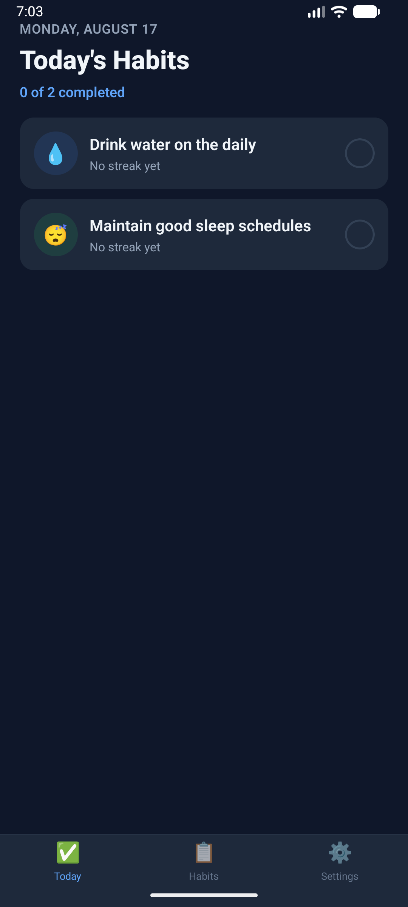
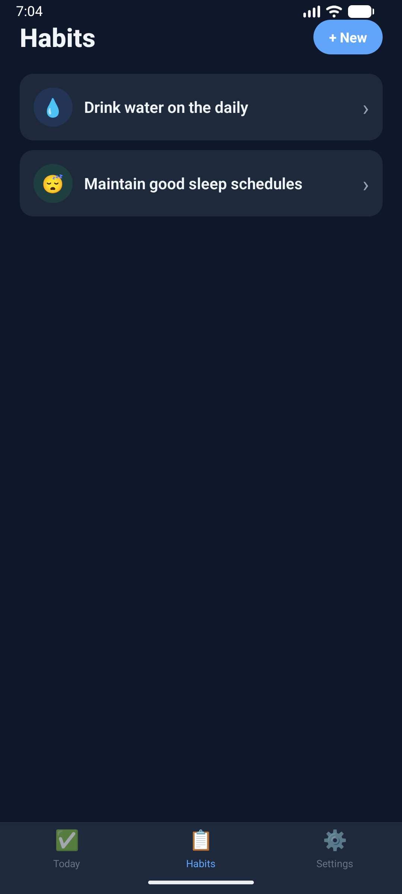
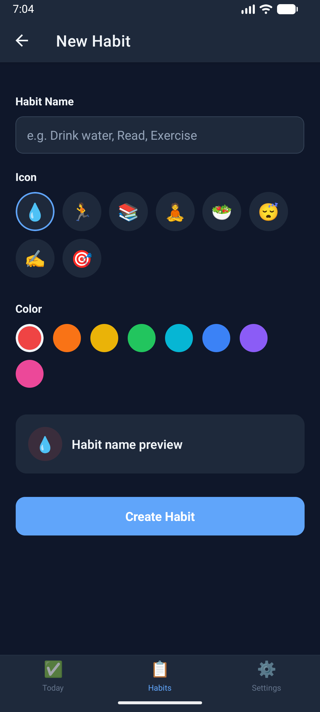
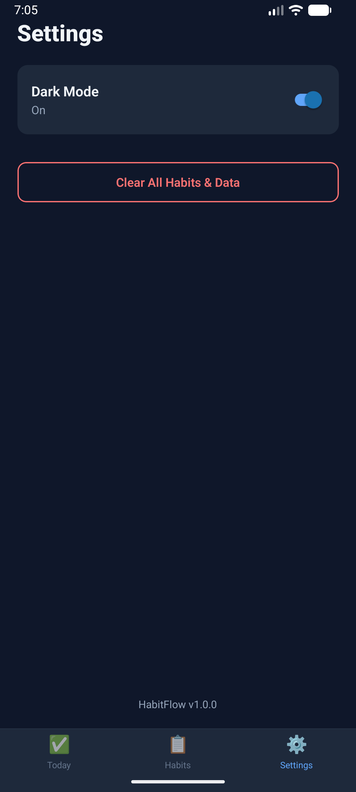
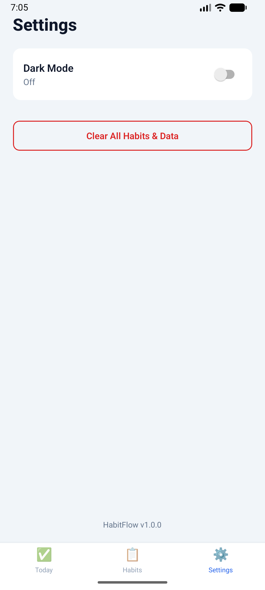

# HabitFlow — Habit Tracker

A React Native (Expo) habit tracker built for the Mobile Applications module
(UFCF7H-15-3). Create habits, check them off daily, and track streaks over
time — fully offline, no external API required.

## Installation & Run Instructions

1. Clone this repo and install dependencies:
   ```
   npm install
   ```
2. Start the app:
   ```
   npx expo start
   ```
   Scan the QR code with the Expo Go app, or press `a` / `i` to launch an
   Android/iOS emulator.

No API key or `.env` setup is needed — all data is generated and stored
locally on the device.

## Feature List

- Create habits with a custom name, icon, and color
- Check off habits for today from the Today screen
- Automatic streak calculation (current streak + longest streak ever)
- 35-day calendar strip per habit — tap any past day to toggle it
- Delete habits (with a confirmation prompt)
- Dark mode
- Clear all app data from Settings (with a confirmation prompt)
- All data persists across app restarts (AsyncStorage)

## Screenshots

| Today | Habits | Add Habit |
| --- | --- | --- |
|  |  |  |

| Habit Detail | Settings (dark) | Settings (light) |
| --- | --- | --- |
|  |  |  |

## Technologies Used

- React Native (Expo)
- React Navigation (bottom tabs + nested native stacks)
- React Context API for state management (`HabitsContext`, `SettingsContext`)
- AsyncStorage for local persistence
- No external API — deliberate design choice, since the assessment brief
  lists Habit Tracker as a valid non-API-based project idea

## Known Issues / Future Improvements

- No way to edit a habit's name, icon, or color after creation (only
  delete-and-recreate)
- No reminder/notification system yet
- No habit reordering (drag-and-drop) yet
- No automated tests yet

## Project Structure

```
src/
  components/   Reusable UI (HabitRow, EmptyState)
  context/      HabitsContext, SettingsContext
  navigation/   Tab + nested stack navigator setup
  screens/      Today, HabitDetail, AllHabits, AddHabit, Settings
  services/     storage.js (AsyncStorage), dateUtils.js (streak logic)
  theme.js      Light/dark theme tokens, habit color/icon presets
```
